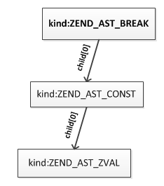

# 附录1：break/continue按标签中断语法实现

## 1.1 背景
首先看下目前PHP中break/continue多层循环的情况：
```php
//loop1
while(...){
    //loop2
    for(...){
        //loop3
        foreach(...){
            ...
            break 2;
        }

    }
    //loop2 end
    ...

}
```
`break 2`表示要中断往上数两层也就是loop2这层循环，`break 2`之后将从loop2 end开始继续执行。PHP的break、continue只能根据数值中断对应的循环，当嵌套循环比较多的时候这种方式维护起来就变得很不方便，需要一层层的去数要中断的循环。

了解Go语言的读者应该知道在Go中可以按照标签中断，举个例子来看：
```go
//test.go
func main() {
loop1:
    for i := 0; i < 2; i++ {
        fmt.Println("loop1")

        for j := 0; j < 5; j++ {
            fmt.Println("  loop2")
            if j == 2 {
                break loop1
            }
        }
    }
}
```
`go run test.go`将输出：
```
loop1
  loop2
  loop2
  loop2
```
`break loop1`这种语法在PHP中是不支持的，接下来我们就对PHP进行改造，让PHP实现同样的功能。

## 1.2 实现
想让PHP支持类似Go语言那样的语法首先需要明确PHP中循环及中断语句的实现，关于这两部分内容前面《PHP基础语法实现》一章已经详细介绍过了，这里再简单概括下实现的关键点:
* 不管是哪种循环结构，其编译时都生成了一个`zend_brk_cont_element`结构，此结构记录着这个循环break、continue要跳转的位置，以及嵌套的父层循环
* break/continue编译时分为两个步骤：首先初步编译为临时opcode，此opcode记录着break/continue所在循环层以及要中断的层级(即:`break n`，默认n=1)；然后在脚本全部编译完之后的pass_two()中，根据当前循环层及中断的层级n向上查找对应的循环层，最后根据查找到的要中断的循环`zend_brk_cont_element`结构得到对应的跳转位置，生成一条ZEND_JMP指令

仔细研究循环、中断的实现可以发现，这里面的关键就在于找到break/continue要中断的那层循环，嵌套循环之间是链表的结构，所以目前的查找就变得很容易了，直接从break/continue当前循环层向前移动n即可。

标签在内核中通过HashTable的结构保存(即：CG(context).labels)，key就是标签名，标签会记录当前opcode的位置，我们要实现`break 标签`的语法需要根据标签取到循环，因此我们为标签赋予一种新的含义：循环标签，只有标签紧挨着循环的才认为是这种含义，比如：
```php
loop1:
for(...){
    ...
}
```
标签与循环之间有其它表达式的则只能认为是普通标签：
```php
loop1:
$a = 123;
for(...){
}
```
既然要按照标签进行break、continue，那么很容易想到把中断的循环层级id保存到标签中，编译break/continue时先查找标签，再查找循环的`zend_brk_cont_element`即可，这样实现的话需要循环编译时将自己`zend_brk_cont_element`的存储位置保存到标签中，标签的结构需要修改，另外一个问题是标签编译不会生成任何opcode，循环结构无法直接根据上一条opcode判断它是不是 ***循环标签*** ，所以我们换一种方式实现，具体思路如下：

* __(1)__ 循环结构开始编译前先编译一条空opcode(ZEND_NOP)，用于标识这是一个循环，并把这个循环`zend_brk_cont_element`的存储位置记录在此opcode中
* __(2)__ break编译时如果发现是一个标签，则从CG(context).labels)中取出标签结构，然后判断此标签的下一条opcode是否为ZEND_NOP，如果不是则说明这不是一个 ***>循环标签*** ，无法break/continue，如果是则取出循环结构
* __(3)__ 得到循环结构之后的处理就比较简单了，但是此时还不能直接编译为ZEND_JMP，因为循环可能还未编译完成，break只能编译为临时opcode，这里可以把标签标记的循环存储位置记录在临时opcode中，然后在pass_two()中再重新获取，需要对pass_two()中的逻辑进行改动，为减少改动，这个地方转化一下实现方式：计算label标记的循环相对break所在循环的位置，也就是转为现有的`break n`，这样以来就无需对pass_two()进行改动了

接下来看下具体的实现，以for为例。

__(1) 编译循环语句__

```c
void zend_compile_for(zend_ast *ast) /* {{{ */
{
    zend_ast *init_ast = ast->child[0];
    zend_ast *cond_ast = ast->child[1];
    zend_ast *loop_ast = ast->child[2];
    zend_ast *stmt_ast = ast->child[3];

    znode result;
    uint32_t opnum_start, opnum_jmp, opnum_loop;
    zend_op *mark_look_opline;
   
    //新增：创建一条空opcode，用于标识接下来是一个循环结构
    mark_look_opline = zend_emit_op(NULL, ZEND_NOP, NULL, NULL);

    zend_compile_expr_list(&result, init_ast);
    zend_do_free(&result);

    opnum_jmp = zend_emit_jump(0);

    zend_begin_loop(ZEND_NOP, NULL);

    //新增：保存当前循环的brk，同时为了防止与其它ZEND_NOP混淆，把op1标为-1
    mark_look_opline->op1.var = -1;
    mark_look_opline->extended_value = CG(context).current_brk_cont;
    ...
}
```

__(2) 编译中断语句__

首先明确一点：`break label`将被编译为以下语法结构：



`ZEND_AST_BREAK`只有一个子节点，如果是数值那么这个子节点类型为`ZEND_AST_ZVAL`，如果是标签则类型是`ZEND_AST_CONST`，`ZEND_AST_CONST`也有一个类型为`ZEND_AST_ZVAL`子节点。下面看下break/continue修改后的编译逻辑：
```c
void zend_compile_break_continue(zend_ast *ast)
{
    zend_ast *depth_ast = ast->child[0];

    zend_op *opline;
    int depth;

    ZEND_ASSERT(ast->kind == ZEND_AST_BREAK || ast->kind == ZEND_AST_CONTINUE);

    if (CG(context).current_brk_cont == -1) {
        zend_error_noreturn(E_COMPILE_ERROR, "'%s' not in the 'loop' or 'switch' context",
            ast->kind == ZEND_AST_BREAK ? "break" : "continue");
    }

    if (depth_ast) {
        
        switch(depth_ast->kind){
            case ZEND_AST_ZVAL: //break 数值;
                {   
                    zval *depth_zv;
                    
                    depth_zv = zend_ast_get_zval(depth_ast);
                    if (Z_TYPE_P(depth_zv) != IS_LONG || Z_LVAL_P(depth_zv) < 1) {
                        zend_error_noreturn(E_COMPILE_ERROR, "'%s' operator accepts only positive numbers",
                                ast->kind == ZEND_AST_BREAK ? "break" : "continue");
                    }
                    
                    depth = Z_LVAL_P(depth_zv);
                    break;
                }
            case ZEND_AST_CONST://break 标签;
                {   
                    //获取label名称
                    zend_string *label = zend_ast_get_str(depth_ast->child[0]);
                    //根据label获取标记的循环，以及相对break所在循环的位置 
                    depth = zend_loop_get_depth_by_label(label);
                    if(depth > 0){
                        goto SET_OP;
                    }
                    break;
                }
            default:
                zend_error_noreturn(E_COMPILE_ERROR, "'%s' operator with non-constant operand "
                        "is no longer supported", ast->kind == ZEND_AST_BREAK ? "break" : "continue");
        }
    } else {
        depth = 1;
    }

    if (!zend_handle_loops_and_finally_ex(depth)) {
        zend_error_noreturn(E_COMPILE_ERROR, "Cannot '%s' %d level%s",
                ast->kind == ZEND_AST_BREAK ? "break" : "continue",
                depth, depth == 1 ? "" : "s");
    }

SET_OP:
    opline = zend_emit_op(NULL, ast->kind == ZEND_AST_BREAK ? ZEND_BRK : ZEND_CONT, NULL, NULL);
    opline->op1.num = CG(context).current_brk_cont;
    opline->op2.num = depth;
}
```
`zend_loop_get_depth_by_label()`这个函数用来计算标签标记的循环相对break/continue所在循环的层级：
```c
int zend_loop_get_depth_by_label(zend_string *label_name)
{
    zval *label_zv;
    zend_label *label;
    zend_op *next_opline;
                    
    if(UNEXPECTED(CG(context).labels == NULL)){
        zend_error_noreturn(E_COMPILE_ERROR, "can't find label:'%s' or it not mark a loop", ZSTR_VAL(label_name));
    }
                
    // 1) 查找label
    label_zv = zend_hash_find(CG(context).labels, label_name);
    if(UNEXPECTED(label_zv == NULL)){
        zend_error_noreturn(E_COMPILE_ERROR, "can't find label:'%s' or it not mark a loop", ZSTR_VAL(label_name));
    }

    label = (zend_label *)Z_PTR_P(label_zv);
        
    // 2) 获取label下一条opcode
    next_opline = &(CG(active_op_array)->opcodes[label->opline_num]);
    if(UNEXPECTED(next_opline == NULL)){
        zend_error_noreturn(E_COMPILE_ERROR, "can't find label:'%s' or it not mark a loop", ZSTR_VAL(label_name));
    }
    
    int label_brk_offset, curr_brk_offset; //标签标识的循环、break当前所在循环
    int depth = 0; //break当前循环至标签循环的层级
    zend_brk_cont_element *brk_cont_element;

    if(next_opline->opcode == ZEND_NOP && next_opline->op1.var == -1){
        label_brk_offset = next_opline->extended_value;
        curr_brk_offset = CG(context).current_brk_cont;

        brk_cont_element = &(CG(active_op_array)->brk_cont_array[curr_brk_offset]);
        //计算标签标记的循环相对位置
        while(1){
            depth++;

            if(label_brk_offset == curr_brk_offset){
                return depth;
            }

            curr_brk_offset = brk_cont_element->parent;
            if(curr_brk_offset < 0){
                //label标识的不是break所在循环
                zend_error_noreturn(E_COMPILE_ERROR, "can't break/conitnue label:'%s' because it not mark a loop", ZSTR_VAL(label_name));
            }
        }
    }else{
        //label没有标识一个循环
        zend_error_noreturn(E_COMPILE_ERROR, "can't break/conitnue label:'%s' because it not mark a loop", ZSTR_VAL(label_name));
    }

    return -1;
}
```
改动后重新编译PHP，然后测试新的语法是否生效：
```php
//test.php

loop1:
for($i = 0; $i < 2; $i++){
    echo "loop1\n";
    
    for($j = 0; $j < 5; $j++){
        echo "  loop2\n";
        if($j == 2){
            break loop1;
        }
    }
}
```
`php test.php`输出：
```
loop1
  loop2
  loop2
  loop2
```
其它几个循环结构的改动与for相同，有兴趣的可以自己去尝试下。

